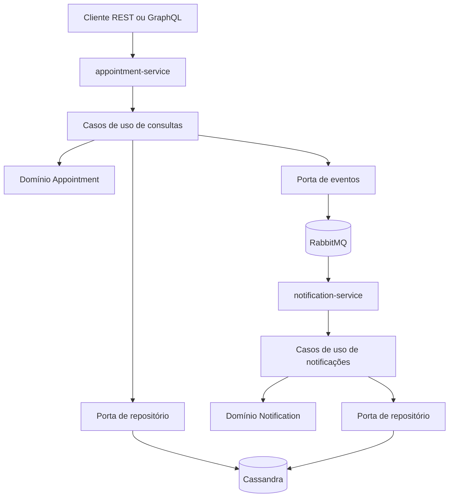
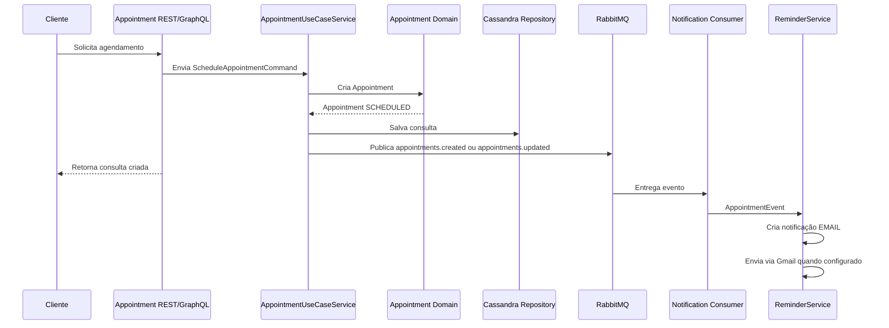

# Tech Challenge 3

> Guia principal do projeto: como rodar, testar e entender a implementação dos microserviços hospitalares com Spring Boot, Cassandra, RabbitMQ, REST e GraphQL.

<div align="center">


</div>

---

## Sumário

- [Visão Geral](#visão-geral)
- [O que foi implementado](#o-que-foi-implementado)
- [Como rodar](#como-rodar)
- [Postman](#postman)
- [Por que essa arquitetura existe](#por-que-essa-arquitetura-existe)
- [Arquitetura de alto nível](#arquitetura-de-alto-nível)
- [Serviços criados](#serviços-criados)
- [Entidades de domínio](#entidades-de-domínio)
- [Camada de aplicação](#camada-de-aplicação)
- [Portas e adaptadores](#portas-e-adaptadores)
- [Fluxo de agendamento](#fluxo-de-agendamento)
- [Persistência com Cassandra](#persistência-com-cassandra)
- [Mensageria com RabbitMQ](#mensageria-com-rabbitmq)
- [APIs REST](#apis-rest)
- [APIs GraphQL](#apis-graphql)
- [Segurança](#segurança)
- [Contrato HTTP e erros](#contrato-http-e-erros)
- [Profiles de execução](#profiles-de-execução)
- [Testes implementados](#testes-implementados)
- [Boas práticas aplicadas](#boas-práticas-aplicadas)
- [Trade-offs e limitações atuais](#trade-offs-e-limitações-atuais)
- [Comandos úteis](#comandos-úteis)
- [Resumo final](#resumo-final)

---

## Visão Geral

O projeto implementa uma base de microserviços para um contexto hospitalar, com foco em:

- agendamento de consultas;
- histórico de consultas por paciente;
- publicação de eventos quando uma consulta é criada ou atualizada;
- registro de lembretes a partir desses eventos;
- envio de e-mail pelo Gmail quando o SMTP está configurado;
- persistência em Cassandra;
- comunicação assíncrona com RabbitMQ;
- exposição de APIs REST e GraphQL.

<div style="border-left:4px solid #2b6cb0; padding:12px 16px; background:#f7fafc; margin:16px 0;">
  <strong>Ideia central:</strong> o appointment-service é responsável pelo ciclo de vida da consulta, enquanto o notification-service reage aos eventos de agendamento para criar e enviar lembretes.
</div>

---

## O que foi implementado

Foram criados dois serviços independentes em Spring Boot:

| Serviço | Porta | Responsabilidade principal |
| --- | ---: | --- |
| `appointment-service` | `8080` | Gerenciar consultas, histórico por paciente e eventos de agendamento |
| `notification-service` | `8081` | Gerenciar notificações e consumir eventos de consulta criada ou atualizada |

Também foram configurados os componentes de infraestrutura:

| Componente | Porta | Uso |
| --- | ---: | --- |
| Cassandra | `9042` | Persistência dos dados |
| RabbitMQ | `5672` | Comunicação assíncrona entre serviços |
| RabbitMQ Management | `15672` | Painel administrativo do RabbitMQ |

### Entregas principais

- Estrutura de microserviços com Gradle e Java 21.
- Dockerfile para cada serviço.
- Docker Compose com Cassandra, RabbitMQ e os dois serviços.
- Domínio de consultas médicas.
- Domínio de notificações.
- Casos de uso de aplicação.
- Portas de entrada e saída.
- Adapters REST.
- Adapters GraphQL.
- Basic Auth nos serviços HTTP com perfis `MEDICO`, `ENFERMEIRO` e `PACIENTE`.
- Adapters em memória para desenvolvimento local.
- Adapters Cassandra para execução com Docker.
- Publicador RabbitMQ no serviço de consultas.
- Consumidor RabbitMQ no serviço de notificações.
- Healthchecks via Spring Actuator.
- Collection Postman única para executar os cenários principais.
- Testes automatizados nos dois serviços.

---

## Como rodar

### Ambiente completo com Docker

```bash
cp .env.example .env
# ajuste o .env se precisar configurar SMTP do Gmail ou sobrescrever defaults
docker compose up -d
```

### Validar containers e logs

```bash
docker compose ps
docker compose logs -f cassandra
docker compose logs -f rabbitmq
docker compose logs -f appointment-service
docker compose logs -f notification-service
```

### Portas

| Serviço | Porta local | Uso |
| --- | ---: | --- |
| Cassandra | `9042` | CQL |
| RabbitMQ | `5672` | AMQP |
| RabbitMQ Management | `15672` | Painel web, usuário `guest`, senha `guest` |
| appointment-service | `8080` | REST, GraphQL e Actuator |
| notification-service | `8081` | REST, GraphQL e Actuator |
| appointment-service debug | `5005` | Attach remoto JVM/JDWP |
| notification-service debug | `5006` | Attach remoto JVM/JDWP |

### Healthchecks

```bash
curl http://localhost:8080/actuator/health
curl http://localhost:8081/actuator/health
```

### Debug remoto com Docker

O Docker Compose já sobe os dois serviços com JDWP ativo e `suspend=n`, então eles iniciam normalmente e aceitam attach do debugger:

| Serviço | Host | Porta |
| --- | --- | ---: |
| appointment-service | `localhost` | `5005` |
| notification-service | `localhost` | `5006` |

No IntelliJ IDEA, Eclipse ou VS Code, crie uma configuração de debug remoto do tipo JVM/JDWP com host `localhost` e a porta do serviço desejado. Depois suba ou reconstrua o ambiente:

```bash
docker compose up -d --build
```

Se precisar parar o serviço logo no boot até o debugger anexar, altere no `.env` o trecho `suspend=n` para `suspend=y` na variável do serviço:

```env
APPOINTMENT_JAVA_TOOL_OPTIONS=-agentlib:jdwp=transport=dt_socket,server=y,suspend=y,address=*:5005
NOTIFICATION_JAVA_TOOL_OPTIONS=-agentlib:jdwp=transport=dt_socket,server=y,suspend=y,address=*:5006
```

### Variáveis de ambiente principais

Os serviços usam o profile `docker` no compose.

| Variável | Valor padrão | Descrição |
| --- | --- | --- |
| `SPRING_PROFILES_ACTIVE` | `docker` | Ativa configuração de containers |
| `SPRING_CASSANDRA_CONTACT_POINTS` | `cassandra` | Host do Cassandra dentro da rede Docker |
| `SPRING_CASSANDRA_PORT` | `9042` | Porta CQL |
| `SPRING_CASSANDRA_KEYSPACE` | `hospital` | Keyspace criado automaticamente pelos serviços |
| `SPRING_CASSANDRA_LOCAL_DATACENTER` | `dc1` | Datacenter local do Cassandra |
| `SPRING_RABBITMQ_HOST` | `rabbitmq` | Host do RabbitMQ dentro da rede Docker |
| `SPRING_RABBITMQ_PORT` | `5672` | Porta AMQP |
| `APPOINTMENTS_QUEUE` | `appointments.queue` | Fila consumida pelo notification-service |
| `APPOINTMENTS_EXCHANGE` | `appointments.exchange` | Exchange dos eventos de consulta |
| `APPOINTMENT_JAVA_TOOL_OPTIONS` | JDWP na porta `5005` | Opções JVM do debug remoto do appointment-service |
| `NOTIFICATION_JAVA_TOOL_OPTIONS` | JDWP na porta `5006` | Opções JVM do debug remoto do notification-service |
| `GMAIL_SMTP_HOST` | `smtp.gmail.com` | Host SMTP usado pelo envio de e-mail |
| `GMAIL_SMTP_PORT` | `587` | Porta SMTP com STARTTLS |
| `GMAIL_USERNAME` | vazio | Conta Gmail remetente |
| `GMAIL_APP_PASSWORD` | vazio | App password do Gmail |
| `GMAIL_FROM` | vazio | Remetente exibido; quando vazio usa `GMAIL_USERNAME` |
| `PATIENT_REMINDER_FALLBACK_RECIPIENT` | `paciente@hospital.com` | Destinatário usado pelo lembrete automático quando o paciente não tiver e-mail resolvido localmente |

### Envio de e-mail pelo Gmail

O `notification-service` envia notificações do canal `EMAIL` usando SMTP do Gmail. Esse envio pode acontecer de duas formas:

- automaticamente, quando o serviço consome um evento RabbitMQ de consulta criada ou editada;
- manualmente, ao chamar `POST /notifications/{id}/send`.

Para envio real, configure uma senha de app no Google e preencha o `.env` antes de subir o Docker Compose:

```env
GMAIL_USERNAME=sua-conta@gmail.com
GMAIL_APP_PASSWORD=sua-senha-de-app
GMAIL_FROM=sua-conta@gmail.com
PATIENT_REMINDER_FALLBACK_RECIPIENT=paciente-real@example.com
```

Depois aplique a configuração:

```bash
docker compose up -d --build notification-service
```

Se `GMAIL_USERNAME` ou `GMAIL_APP_PASSWORD` não estiverem configurados, o serviço não tenta acessar o Gmail. A notificação automática continua registrada, mas o envio fica com status `FAILED` e `failureReason` informa que o Gmail SMTP não foi configurado.

### Build e testes

```bash
cd appointment-service && ./gradlew clean build -x test --no-daemon
cd appointment-service && ./gradlew test --no-daemon
cd notification-service && ./gradlew clean build -x test --no-daemon
cd notification-service && ./gradlew test --no-daemon
```

### Parar o ambiente

```bash
docker compose down
```

Para remover também o volume persistente do Cassandra:

```bash
docker compose down -v
```

---

## Postman

Os testes manuais principais ficam consolidados em uma collection e um environment:

- [Collection única](postman/Tech-Challenge.postman_collection.json)
- [Environment local](postman/Tech-Challenge.postman_environment.json)

Como executar:

1. Importe os dois arquivos no Postman.
2. Selecione o environment `Tech Challenge - Local`.
3. Abra a collection `Tech Challenge - Collection Unica`.
4. Clique em `Run collection`.

A collection cobre health, autenticação, REST, GraphQL, permissões por perfil, erros HTTP e notification-service. Alguns cenários salvam IDs no environment durante a execução, então mantenha a ordem da collection no Runner.

---

## Por que essa arquitetura existe

A arquitetura foi organizada para evitar que regras de negócio fiquem misturadas com detalhes de banco, fila ou protocolo HTTP.

Em vez de o controller chamar diretamente Cassandra ou RabbitMQ, o fluxo passa por casos de uso e interfaces. Isso reduz acoplamento e facilita trocar infraestrutura no futuro.

| Problema comum | Solução aplicada |
| --- | --- |
| Controller com regra de negócio | Regras ficam no domínio e na camada de aplicação |
| Dependência direta de banco | Uso de portas de repositório |
| Dificuldade para testar | Adapters em memória e serviços de aplicação isolados |
| Integração rígida entre serviços | Evento assíncrono via RabbitMQ |
| Histórico de paciente lento ou mal modelado | Tabela Cassandra orientada à consulta por `patient_id` |

---

## Arquitetura de alto nível



### Organização por responsabilidade

| Camada | O que faz | Exemplo no projeto |
| --- | --- | --- |
| Domain | Regras centrais e estados válidos | `Appointment`, `Notification` |
| Application | Orquestra casos de uso | `AppointmentUseCaseService`, `NotificationUseCaseService` |
| Ports | Contratos de entrada e saída | `AppointmentRepositoryPort`, `NotificationSenderPort` |
| Inbound adapters | Recebem chamadas externas | Controllers REST, GraphQL e RabbitMQ listener |
| Outbound adapters | Falam com infraestrutura | Cassandra, RabbitMQ, adapters em memória |

---

## Serviços criados

### appointment-service

O `appointment-service` concentra tudo que envolve consultas.

#### Responsabilidades

- Criar uma consulta.
- Buscar uma consulta por ID.
- Listar todas as consultas.
- Listar histórico de consultas por paciente.
- Listar próximas consultas por paciente.
- Confirmar uma consulta.
- Cancelar uma consulta.
- Publicar evento quando uma consulta é criada, editada, confirmada ou cancelada.

#### Estrutura principal

```text
appointment-service/
└── src/main/java/appointment_service
    ├── application
    │   ├── port/in
    │   ├── port/out
    │   └── service
    ├── domain
    ├── api
    │   ├── graphql
    │   ├── internal
    │   └── rest
    ├── config
    └── infrastructure
        ├── cassandra
        ├── memory
        └── rabbitmq
```

### notification-service

O `notification-service` concentra tudo que envolve notificações.

#### Responsabilidades

- Criar notificações manualmente.
- Buscar notificação por ID.
- Listar notificações.
- Enviar notificação.
- Consumir eventos de consulta da fila `appointments.queue`.
- Criar e enviar lembretes automáticos quando uma consulta é criada ou atualizada.

#### Estrutura principal

```text
notification-service/
└── src/main/java/notification_service
    ├── application
    │   ├── port/in
    │   ├── port/out
    │   └── service
    ├── domain
    ├── api
    │   ├── graphql
    │   ├── internal
    │   ├── rabbitmq
    │   └── rest
    ├── config
    └── infrastructure
        ├── cassandra
        ├── memory
        └── rabbitmq
```

---

## Entidades de domínio

### Appointment

A entidade `Appointment` representa uma consulta médica.

#### Campos principais

| Campo | Tipo | Descrição |
| --- | --- | --- |
| `id` | `UUID` | Identificador da consulta |
| `patientId` | `UUID` | Identificador do paciente |
| `professionalId` | `UUID` | Identificador do profissional |
| `professionalName` | `String` | Nome do profissional |
| `scheduledAt` | `Instant` | Data e hora da consulta |
| `status` | `AppointmentStatus` | Estado atual da consulta |
| `notes` | `String` | Observações opcionais |
| `createdAt` | `Instant` | Data de criação |
| `updatedAt` | `Instant` | Data da última alteração |

#### Estados possíveis

| Status | Significado |
| --- | --- |
| `SCHEDULED` | Consulta criada e aguardando confirmação ou cancelamento |
| `CONFIRMED` | Consulta confirmada |
| `CANCELED` | Consulta cancelada |

#### Regras implementadas

- Uma consulta só pode ser agendada para uma data futura.
- `patientId`, `professionalId`, `professionalName`, `scheduledAt`, `status`, `createdAt` e `updatedAt` são obrigatórios.
- `notes` é opcional e passa por normalização.
- Uma consulta só pode ser confirmada se estiver com status `SCHEDULED`.
- Uma consulta já cancelada não pode ser cancelada novamente.
- Toda alteração relevante atualiza `updatedAt`.

#### Criação de consulta

```java
Appointment appointment = Appointment.schedule(
    patientId,
    professionalId,
    "Dra. Marina Costa",
    scheduledAt,
    "Consulta inicial"
);
```

### User

A entidade `User` representa um usuário base do sistema.

| Campo | Tipo | Descrição |
| --- | --- | --- |
| `id` | `UUID` | Identificador do usuário |
| `email` | `String` | E-mail normalizado para minúsculas |
| `fullName` | `String` | Nome completo |
| `passwordHash` | `String` | Hash da senha |
| `role` | `UserRole` | Papel do usuário |

#### Papéis possíveis

| Role | Significado |
| --- | --- |
| `PACIENTE` | Paciente |
| `MEDICO` | Médico |
| `ENFERMEIRO` | Enfermeiro |
| `ADMIN` | Administrador |

<div style="border-left:4px solid #805ad5; padding:12px 16px; background:#faf5ff; margin:16px 0;">
  <strong>Observação:</strong> o appointment-service já usa Basic Auth com usuários carregados por UserRepositoryPort. Ainda não há fluxo público de cadastro ou login com token; os usuários seedados atendem os cenários locais e Docker.
</div>

### Patient

A entidade `Patient` representa a relação de um paciente com um usuário.

| Campo | Tipo | Descrição |
| --- | --- | --- |
| `id` | `UUID` | Identificador do paciente |
| `userId` | `UUID` | Identificador do usuário associado |
| `fullName` | `String` | Nome completo do paciente |

#### Regras implementadas

- `id` é obrigatório.
- `userId` é obrigatório.
- `fullName` é obrigatório e passa por trim.

### Notification

A entidade `Notification` representa uma notificação gerada pelo sistema.

#### Campos principais

| Campo | Tipo | Descrição |
| --- | --- | --- |
| `id` | `UUID` | Identificador da notificação |
| `appointmentId` | `UUID` | Consulta que originou a notificação |
| `recipient` | `String` | Destinatário |
| `subject` | `String` | Assunto |
| `message` | `String` | Conteúdo |
| `channel` | `NotificationChannel` | Canal de envio |
| `status` | `NotificationStatus` | Estado atual |
| `createdAt` | `Instant` | Data de criação |
| `sentAt` | `Instant` | Data de envio, quando houver |
| `failureReason` | `String` | Motivo de falha, quando houver |

#### Canais possíveis

| Canal | Significado |
| --- | --- |
| `EMAIL` | Envio por e-mail |
| `SMS` | Envio por SMS |
| `PUSH` | Envio por push notification |

#### Estados possíveis

| Status | Significado |
| --- | --- |
| `PENDING` | Notificação criada e ainda não enviada |
| `SENT` | Notificação enviada |
| `FAILED` | Notificação marcada como falha |

#### Regras implementadas

- Toda notificação nasce como `PENDING`.
- `appointmentId`, `recipient`, `subject`, `message`, `channel`, `status` e `createdAt` são obrigatórios.
- `sentAt` e `failureReason` são opcionais.
- `markSent()` marca a notificação como enviada e define `sentAt`.
- Uma notificação já enviada não pode ser enviada novamente.
- `markFailed(reason)` marca a notificação como falha.
- No canal `EMAIL`, o envio real acontece via Gmail quando `GMAIL_USERNAME` e `GMAIL_APP_PASSWORD` estão configurados.
- Sem configuração de Gmail, a notificação é salva como `FAILED` e o motivo fica em `failureReason`.

---

## Camada de aplicação

A camada de aplicação recebe comandos dos adapters e coordena o domínio com as portas de saída.

### AppointmentUseCaseService

Implementa os seguintes casos de uso:

| Caso de uso | Método | O que faz |
| --- | --- | --- |
| `ScheduleAppointmentUseCase` | `schedule` | Cria consulta, salva e publica evento |
| `UpdateAppointmentUseCase` | `update` | Atualiza consulta, salva e publica evento |
| `GetAppointmentUseCase` | `getById` | Busca consulta por ID |
| `ListAppointmentsUseCase` | `list` | Lista todas as consultas |
| `ListPatientAppointmentsUseCase` | `listByPatient` | Lista histórico por paciente |
| `ListPatientAppointmentsUseCase` | `listUpcomingByPatient` | Lista próximas consultas por paciente |
| `ConfirmAppointmentUseCase` | `confirm` | Confirma uma consulta |
| `CancelAppointmentUseCase` | `cancel` | Cancela uma consulta |

#### Fluxo interno do agendamento

```text
ScheduleAppointmentCommand
        |
        v
Appointment.schedule()
        |
        v
AppointmentRepositoryPort.save()
        |
        v
AppointmentEventPublisherPort.appointmentScheduled()
        |
        v
AppointmentView
```

### NotificationUseCaseService

Implementa os seguintes casos de uso:

| Caso de uso | Método | O que faz |
| --- | --- | --- |
| `CreateNotificationUseCase` | `create` | Cria notificação |
| `GetNotificationUseCase` | `getById` | Busca notificação por ID |
| `ListNotificationsUseCase` | `list` | Lista notificações |
| `SendNotificationUseCase` | `send` | Envia e marca como enviada |
| `ReminderService` | `process` | Cria e envia lembrete a partir de evento de consulta |

#### Fluxo interno do lembrete automático

```text
AppointmentEvent
        |
        v
ReminderService.process()
        |
        v
CreateNotificationUseCase.create()
        |
        v
SendNotificationUseCase.send()
        |
        v
Notification SENT ou FAILED
```

---

## Portas e adaptadores

O projeto segue uma organização próxima da arquitetura hexagonal.

### Portas de entrada

As portas de entrada representam ações que a aplicação sabe executar.

| Serviço | Porta | Responsabilidade |
| --- | --- | --- |
| appointment-service | `ScheduleAppointmentUseCase` | Agendar consulta |
| appointment-service | `UpdateAppointmentUseCase` | Atualizar consulta |
| appointment-service | `GetAppointmentUseCase` | Buscar consulta |
| appointment-service | `ListAppointmentsUseCase` | Listar consultas |
| appointment-service | `ListPatientAppointmentsUseCase` | Consultar histórico por paciente |
| appointment-service | `ConfirmAppointmentUseCase` | Confirmar consulta |
| appointment-service | `CancelAppointmentUseCase` | Cancelar consulta |
| notification-service | `CreateNotificationUseCase` | Criar notificação |
| notification-service | `GetNotificationUseCase` | Buscar notificação |
| notification-service | `ListNotificationsUseCase` | Listar notificações |
| notification-service | `SendNotificationUseCase` | Enviar notificação |
| notification-service | `ReminderService` | Processar lembrete do paciente a partir de evento de consulta |

### Portas de saída

As portas de saída isolam infraestrutura.

| Serviço | Porta | Implementações |
| --- | --- | --- |
| appointment-service | `AppointmentRepositoryPort` | Memória e Cassandra |
| appointment-service | `AppointmentEventPublisherPort` | Log e RabbitMQ |
| notification-service | `NotificationRepositoryPort` | Memória e Cassandra |
| notification-service | `NotificationSenderPort` | Gmail SMTP com falha controlada quando não configurado |

### Por que isso importa

Essa separação permite executar o projeto em dois modos:

- local simples, usando memória e log;
- ambiente Docker, usando Cassandra e RabbitMQ.

O domínio e os casos de uso não precisam saber qual infraestrutura está ativa.

---

## Fluxo de agendamento



### Resultado esperado

Ao criar uma consulta no `appointment-service`, o sistema:

1. valida a data futura;
2. cria uma consulta com status `SCHEDULED`;
3. persiste a consulta;
4. publica um evento no exchange `appointments.exchange` com routing key `appointments.created` ou `appointments.updated`;
5. o `notification-service` consome o evento;
6. o `ReminderService` cria uma notificação `EMAIL`;
7. o envio é tentado automaticamente via Gmail;
8. a notificação fica como `SENT` ou `FAILED`, com `failureReason` quando houver falha.

---

## Persistência com Cassandra

O Cassandra foi escolhido para persistir dados orientados a consulta. A modelagem principal foi feita a partir do acesso mais importante do appointment-service: listar consultas por paciente.

### Keyspace

```sql
CREATE KEYSPACE IF NOT EXISTS hospital
WITH replication = {'class': 'SimpleStrategy', 'replication_factor': 1};
```

### Tabela de usuários

```sql
CREATE TABLE IF NOT EXISTS users_by_email (
  email text PRIMARY KEY,
  user_id uuid,
  full_name text,
  password_hash text,
  role text
);
```

#### Objetivo

Servir como base para um fluxo futuro de usuários e autenticação.

### Tabela de consultas por paciente

```sql
CREATE TABLE IF NOT EXISTS patient_appointments_by_patient (
  patient_id uuid,
  scheduled_at timestamp,
  appointment_id uuid,
  professional_id uuid,
  professional_name text,
  status text,
  notes text,
  created_at timestamp,
  updated_at timestamp,
  PRIMARY KEY ((patient_id), scheduled_at, appointment_id)
) WITH CLUSTERING ORDER BY (scheduled_at DESC, appointment_id ASC);
```

#### Por que a chave foi modelada assim

| Parte da chave | Função |
| --- | --- |
| `patient_id` | Particiona os dados por paciente |
| `scheduled_at` | Ordena as consultas por data |
| `appointment_id` | Garante unicidade dentro da mesma data |

#### Impacto arquitetural

Essa tabela favorece consultas como:

- histórico de consultas de um paciente;
- próximas consultas de um paciente;
- ordenação por data de agendamento.

Em Cassandra, a modelagem parte da pergunta que o sistema precisa responder. Por isso a tabela não é uma modelagem relacional genérica, mas uma tabela orientada ao acesso.

### Tabela de notificações

O `notification-service` cria automaticamente a tabela `notifications` no startup quando roda com profile `docker`.

```sql
CREATE TABLE IF NOT EXISTS notifications (
  id uuid PRIMARY KEY,
  appointment_id uuid,
  recipient text,
  subject text,
  message text,
  channel text,
  status text,
  created_at timestamp,
  sent_at timestamp,
  failure_reason text
);
```

## Mensageria com RabbitMQ

A fila principal implementada é:

| Fila | Produtor | Consumidor | Evento |
| --- | --- | --- | --- |
| `appointments.queue` | `appointment-service` | `notification-service` | Eventos `APPOINTMENT_CREATED` e `APPOINTMENT_UPDATED` |

### Evento publicado

Quando uma consulta é criada ou atualizada, o `appointment-service` publica um JSON com estes campos:

```json
{
  "eventType": "APPOINTMENT_CREATED",
  "eventId": "uuid-do-evento",
  "appointmentId": "uuid-da-consulta",
  "patientId": "uuid-do-paciente",
  "scheduledAt": "2030-04-13T10:00:00Z",
  "status": "SCHEDULED"
}
```

### Consumo do evento

O `notification-service` consome a mensagem por meio de `@RabbitListener`, desserializa o payload como `AppointmentEvent` e delega para o `ReminderService`.

Depois disso, ele cria uma notificação `EMAIL`, resolve o destinatário e aciona o sender configurado. O paciente seedado `00000000-0000-0000-0000-000000000601` resolve para `paciente@hospital.com`; para outros pacientes, o serviço usa `PATIENT_REMINDER_FALLBACK_RECIPIENT`.

| Campo | Valor |
| --- | --- |
| `eventId` | ID único do evento |
| `eventType` | `APPOINTMENT_CREATED` ou `APPOINTMENT_UPDATED` |
| `appointmentId` | ID da consulta |
| `patientId` | ID do paciente |
| `scheduledAt` | Data da consulta |
| `status` | Status atual da consulta |
| `notificationId` | ID da notificação criada automaticamente |
| `notificationStatus` | `SENT` ou `FAILED` |

---

## APIs REST

### appointment-service

Base URL local:

```text
http://localhost:8080
```

#### Endpoints

| Método | Endpoint | O que faz |
| --- | --- | --- |
| `POST` | `/api/appointments` ou `/appointments` | Cria uma consulta |
| `PUT` | `/api/appointments/{appointmentId}` ou `/appointments/{appointmentId}` | Atualiza uma consulta |
| `GET` | `/api/appointments/{appointmentId}` ou `/appointments/{appointmentId}` | Busca consulta por ID |
| `GET` | `/api/appointments` ou `/appointments` | Lista todas as consultas |
| `GET` | `/api/appointments/patients/{patientId}` ou `/appointments/patients/{patientId}` | Lista histórico do paciente |
| `GET` | `/api/appointments/patients/{patientId}/upcoming` ou `/appointments/patients/{patientId}/upcoming` | Lista próximas consultas do paciente |
| `POST` | `/api/appointments/{appointmentId}/confirm` ou `/appointments/{appointmentId}/confirm` | Confirma consulta |
| `POST` | `/api/appointments/{appointmentId}/cancel` ou `/appointments/{appointmentId}/cancel` | Cancela consulta |

#### Exemplo de agendamento

```bash
curl -u medico@hospital.com:123456 -X POST http://localhost:8080/api/appointments \
  -H "Content-Type: application/json" \
  -d '{
    "patientId": "00000000-0000-0000-0000-000000000601",
    "professionalId": "00000000-0000-0000-0000-000000000701",
    "professionalName": "Dra. Marina Costa",
    "scheduledAt": "2030-04-13T10:00:00Z",
    "status": "SCHEDULED",
    "notes": "Consulta inicial"
  }'
```

#### Exemplo de resposta

```json
{
  "appointmentId": "uuid-gerado",
  "patientId": "00000000-0000-0000-0000-000000000601",
  "professionalId": "00000000-0000-0000-0000-000000000701",
  "professionalName": "Dra. Marina Costa",
  "scheduledAt": "2030-04-13T10:00:00Z",
  "status": "SCHEDULED",
  "notes": "Consulta inicial",
  "createdAt": "data-de-criacao",
  "updatedAt": "data-de-atualizacao"
}
```

### notification-service

Base URL local:

```text
http://localhost:8081
```

#### Endpoints

| Método | Endpoint | O que faz |
| --- | --- | --- |
| `POST` | `/notifications` | Cria uma notificação manualmente |
| `GET` | `/notifications/{notificationId}` | Busca notificação por ID |
| `GET` | `/notifications` | Lista notificações |
| `POST` | `/notifications/{notificationId}/send` | Envia e marca a notificação como `SENT` |

#### Exemplo de criação manual

```bash
curl -X POST http://localhost:8081/notifications \
  -H "Content-Type: application/json" \
  -d '{
    "appointmentId": "00000000-0000-0000-0000-000000000801",
    "recipient": "paciente@example.com",
    "subject": "Consulta criada ou atualizada",
    "message": "Sua consulta foi agendada com sucesso.",
    "channel": "EMAIL"
  }'
```

---

## APIs GraphQL

Os dois serviços também expõem contratos GraphQL.

### appointment-service

#### Queries

| Query | Descrição |
| --- | --- |
| `appointments` | Lista consultas |
| `appointmentById(id)` | Busca consulta por ID |
| `patientAppointments(patientId)` | Lista consultas do paciente |
| `upcomingPatientAppointments(patientId)` | Lista próximas consultas do paciente |
| `patientHistory(patientId)` | Retorna histórico completo do paciente |
| `futureAppointments(patientId)` | Retorna apenas consultas futuras do paciente |

#### Mutations

| Mutation | Descrição |
| --- | --- |
| `scheduleAppointment(input)` | Agenda consulta |
| `updateAppointment(id, input)` | Atualiza consulta |
| `confirmAppointment(id)` | Confirma consulta |
| `cancelAppointment(id)` | Cancela consulta |

O contrato documental consolidado fica em [docs/graphql/appointment-service.graphql](docs/graphql/appointment-service.graphql). O schema usado em runtime pelo Spring GraphQL continua em `appointment-service/src/main/resources/graphql/schema.graphqls`.

### notification-service

#### Queries

| Query | Descrição |
| --- | --- |
| `notifications` | Lista notificações |
| `notificationById(id)` | Busca notificação por ID |

#### Mutations

| Mutation | Descrição |
| --- | --- |
| `createNotification(input)` | Cria notificação |
| `sendNotification(id)` | Envia notificação |

---

## Segurança

Os dois serviços HTTP usam Basic Auth.

No `appointment-service`, os usuários são lidos por `UserRepositoryPort`. No profile `docker`, a origem é a tabela Cassandra `users_by_email`; no profile padrão, o mesmo contrato é atendido por adapter em memória.

No `notification-service`, os mesmos usuários seedados são configurados em memória. Essa decisão é melhor para a entrega porque o serviço também expõe endpoints REST/GraphQL próprios; proteger apenas o `appointment-service` deixaria `/notifications` e `/graphql` do serviço de notificações acessíveis diretamente quando a porta `8081` estivesse publicada pelo Docker Compose. O consumo RabbitMQ continua interno e não depende de Basic Auth.

| Usuário | Senha | Papel |
| --- | --- | --- |
| `medico@hospital.com` | `123456` | Médico |
| `doctor@hospital.com` | `123456` | Médico |
| `enfermeiro@hospital.com` | `123456` | Enfermeiro |
| `nurse@hospital.com` | `123456` | Enfermeiro |
| `paciente@hospital.com` | `123456` | Paciente |
| `patient@hospital.com` | `123456` | Paciente |

Regras principais:

- Médico e enfermeiro podem criar, editar, confirmar e cancelar consultas.
- Paciente pode consultar apenas dados do próprio `patientId`.
- Médico e enfermeiro podem acessar os endpoints REST/GraphQL do `notification-service`.
- Paciente não acessa endpoints administrativos de notificações.
- Healthcheck e `/internal/ping` são públicos nos dois serviços.
- Demais endpoints exigem autenticação.

Exemplo autenticado:

```bash
curl -u medico@hospital.com:123456 \
  -X POST http://localhost:8080/api/appointments \
  -H "Content-Type: application/json" \
  -d '{
    "patientId": "00000000-0000-0000-0000-000000000601",
    "professionalId": "00000000-0000-0000-0000-000000000701",
    "professionalName": "Dra. Marina Costa",
    "scheduledAt": "2030-01-10T10:00:00Z",
    "status": "SCHEDULED",
    "notes": "Primeira consulta"
  }'
```

---

## Contrato HTTP e erros

Create e update validam payload antes da regra de negócio. Quando a API REST do `appointment-service` retorna erro, o corpo segue este formato:

```json
{
  "timestamp": "2026-04-14T10:00:00Z",
  "status": 400,
  "error": "Bad Request",
  "code": "VALIDATION_ERROR",
  "message": "Existem campos inválidos no payload.",
  "path": "/api/appointments",
  "traceId": "valor-do-header-X-Trace-Id",
  "fieldErrors": []
}
```

Status principais:

| Status | Uso |
| ---: | --- |
| `201 Created` | Consulta ou notificação criada com body e header `Location` |
| `200 OK` | Recurso atualizado, enviado ou consultado com body |
| `400 Bad Request` | JSON inválido, tipo inválido ou Bean Validation |
| `401 Unauthorized` | Basic Auth ausente ou inválido |
| `403 Forbidden` | Usuário autenticado sem permissão ou paciente acessando outro paciente |
| `404 Not Found` | Consulta, paciente, profissional ou notificação inexistente |
| `409 Conflict` | Profissional já possui consulta no mesmo horário |
| `422 Unprocessable Entity` | Regra de negócio violada |
| `500 Internal Server Error` | Erro inesperado com mensagem genérica |

Códigos usados nos fluxos principais: `VALIDATION_ERROR`, `BAD_REQUEST`, `UNAUTHORIZED`, `ACCESS_DENIED`, `APPOINTMENT_NOT_FOUND`, `PATIENT_NOT_FOUND`, `PROFESSIONAL_NOT_FOUND`, `APPOINTMENT_CONFLICT`, `INVALID_PROFESSIONAL`, `BUSINESS_RULE_VIOLATION` e `INTERNAL_ERROR`.

---

## Profiles de execução

O projeto usa profiles Spring para alternar infraestrutura.

| Profile | Repositório | Mensageria | Quando usar |
| --- | --- | --- | --- |
| padrão | Memória | Log | Desenvolvimento rápido sem containers |
| `docker` | Cassandra | RabbitMQ | Execução integrada com Docker Compose |

### Profile padrão

No profile padrão:

- consultas são salvas em memória;
- notificações são salvas em memória;
- eventos de consulta são publicados como log no `appointment-service`;
- envio de notificação usa o mesmo adapter Gmail, falhando de forma controlada quando SMTP não estiver configurado.

### Profile docker

No profile `docker`:

- Cassandra é usado como banco;
- RabbitMQ é usado como broker;
- a fila `appointments.queue`, o exchange `appointments.exchange` e o binding `appointments.*` são criados;
- os serviços dependem de healthchecks do Cassandra e RabbitMQ;
- Actuator expõe `health`, `info` e `prometheus`.

---

## Testes implementados

### appointment-service

| Teste | O que valida |
| --- | --- |
| `AppointmentServiceApplicationTests` | Contexto Spring sobe corretamente |
| `AppointmentUseCaseServiceTest` | Agendamento, atualização, histórico por paciente e publicação de evento |
| `InMemoryAppointmentRepositoryAdapterTest` | Ordenação do histórico e filtro de próximas consultas |
| `PatientAppointmentRowTest` | Conversão entre domínio e linha Cassandra |
| `RabbitMqAppointmentEventPublisherAdapterTest` | Serialização e publicação de evento no RabbitMQ |
| `PatientAppointmentRestControllerTest` | Permissão do paciente para ler apenas o próprio histórico |

### notification-service

| Teste | O que valida |
| --- | --- |
| `NotificationServiceApplicationTests` | Contexto Spring sobe corretamente |
| `AppointmentNotificationRabbitMqAdapterTest` | Desserialização de evento RabbitMQ e rejeição de payload inválido |

<div style="border-left:4px solid #2f855a; padding:12px 16px; background:#f0fff4; margin:16px 0;">
  <strong>Boa prática já aplicada:</strong> os testes cobrem regras de aplicação, adapters em memória, integração REST de permissão por paciente e contrato de mensageria. Isso protege o fluxo de histórico por paciente e o fluxo assíncrono entre os serviços.
</div>

---

## Boas práticas aplicadas

### Separação de responsabilidades

Controllers não possuem regra de negócio. Eles apenas recebem requisições, convertem dados e chamam casos de uso.

### Domínio com invariantes

As entidades impedem estados inválidos, como:

- consulta no passado;
- consulta sem paciente;
- notificação sem destinatário;
- notificação enviada duas vezes.

### Adapters substituíveis

O mesmo caso de uso funciona com memória ou Cassandra, dependendo do profile.

### Comunicação assíncrona

O agendamento não depende de chamada síncrona ao serviço de notificações. O evento é publicado na fila e processado pelo consumidor.

### Modelagem Cassandra orientada ao acesso

A tabela `patient_appointments_by_patient` foi desenhada para responder diretamente ao histórico de consultas por paciente.

### Contratos REST e GraphQL

Os serviços expõem REST para integração simples e GraphQL para consultas mais flexíveis.

---

## Trade-offs e limitações atuais

Toda implementação técnica carrega escolhas. As principais aqui são:

| Decisão | Benefício | Limitação |
| --- | --- | --- |
| Cassandra por profile Docker | Persistência real no ambiente integrado | Não há migração versionada com Flyway/Liquibase equivalente para Cassandra |
| Adapters em memória no profile padrão | Desenvolvimento rápido | Dados somem ao reiniciar |
| RabbitMQ com `appointments.created` e `appointments.updated` | Integração simples entre serviços | Ainda não há outbox transacional para garantir publicação em falhas intermediárias |
| Lembrete automático via notification-service | Fecha o fluxo assíncrono criando e enviando notificação a partir do evento | Resolução de destinatário ainda é simplificada e usa fallback configurável |
| `findById` de appointment no Cassandra usando `findAll` | Implementação simples inicial | Pode ficar caro com grande volume de dados |
| Basic Auth com usuários seedados | Permite validar perfis e permissões | Ainda não há cadastro público, login com token ou recuperação de senha |
| Gmail SMTP opcional | Permite envio real de e-mail sem impedir execução local | Sem `GMAIL_USERNAME` e `GMAIL_APP_PASSWORD`, a notificação é registrada como `FAILED` |

---

## Erros comuns que essa arquitetura evita

| Erro comum | Como o projeto evita |
| --- | --- |
| Misturar HTTP com regra de negócio | Casos de uso ficam fora dos controllers |
| Acoplar domínio ao Cassandra | Domínio conversa com portas, não com driver |
| Chamada síncrona entre serviços | Notificação nasce por evento assíncrono |
| Criar tabela Cassandra sem consulta-alvo | Histórico por paciente orienta a modelagem |
| Documentação desconectada da entrega | README concentra execução, arquitetura, contratos e validação |

---

## Comandos úteis

### Logs dos serviços

```bash
docker compose logs -f appointment-service
docker compose logs -f notification-service
docker compose logs -f rabbitmq
docker compose logs -f cassandra
```

### Ping interno

```bash
curl http://localhost:8080/internal/ping
curl http://localhost:8081/internal/ping
```

---

## Resumo final

O projeto implementa uma arquitetura inicial de microserviços hospitalares com separação clara entre domínio, aplicação e infraestrutura.

O `appointment-service` gerencia consultas e publica eventos. O `notification-service` gerencia notificações manuais e reage aos eventos de consulta criando e enviando lembretes automaticamente. Cassandra fornece persistência, RabbitMQ conecta os serviços de forma assíncrona, e REST/GraphQL expõem os contratos para clientes externos.

Essa base já permite demonstrar um fluxo completo:

```text
Agendar consulta -> Persistir consulta -> Publicar evento -> Consumir evento -> Criar notificacao -> Enviar lembrete
```

A implementação ainda é uma base evolutiva, mas já possui os blocos principais para crescer com cadastro de usuários, resolução real de destinatários, eventos versionados e testes de integração.
